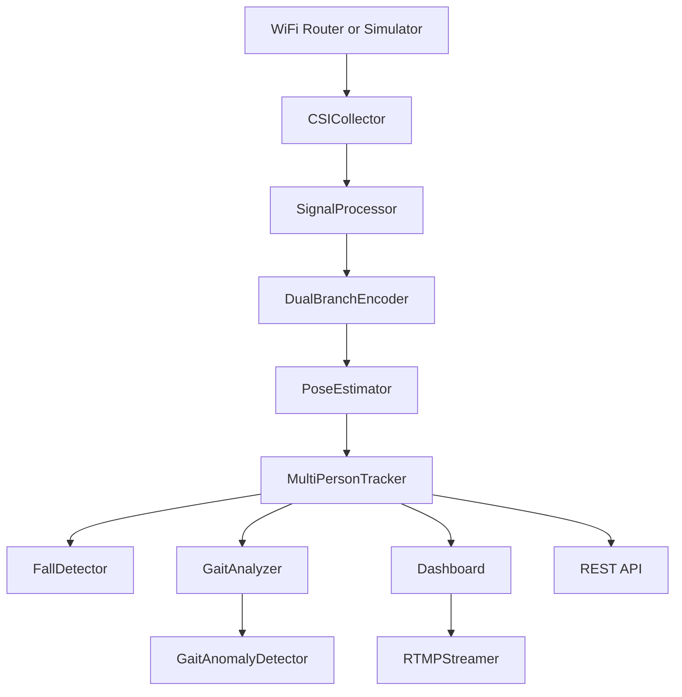
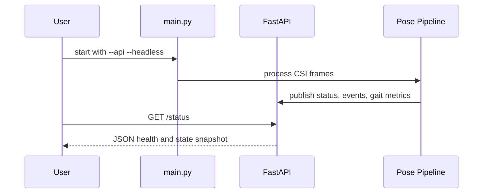
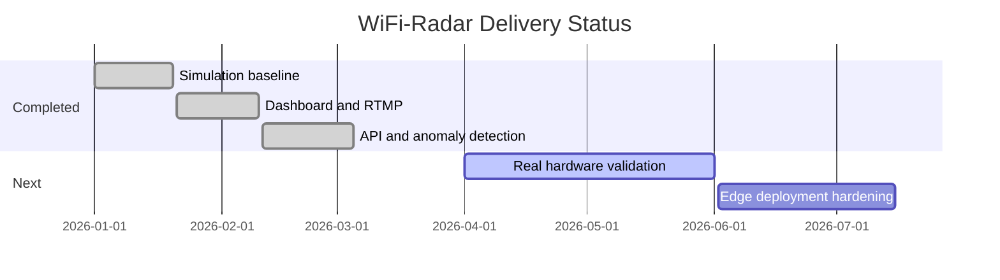

<div align="center">

# 📡 WiFi-Radar

<!-- brass-brief:intro -->
## Executive Summary For Leadership

Wifi Radar is designed to solve a specific business and process problem, not just showcase technical capability. WiFi-Radar is a Python research system for WiFi-based human pose estimation, tracking, fall detection, gait analytics, and headless monitoring. It consumes Channel State Information from commodity WiFi hardware or the built-in simulation pipeline, transforms it into learned embeddings, and emits 17-keypoint 3-D pose outputs in real time. The result is a more repeatable operating model where leadership can compare progress, quality, and impact with less ambiguity.

## Current State Without This Project

Teams lose time to repetitive setup and environment drift. This increases operational friction, slows decision cycles, and makes results harder to compare across teams.

## Why This Project Is Needed Now

This project standardizes execution patterns and reduces operational variability. As a prototype, it allows leadership to validate value early before committing to a larger rollout.

## Expected Process Improvements

- Faster delivery, fewer setup errors, and improved maintainability.
- Better executive visibility into status, bottlenecks, and next priorities.
- Clearer linkage between technical outputs and business decisions.
- Reduced rework through standardized execution patterns.

## Overview

WiFi-Radar is a Python research system for **WiFi-based human pose estimation,
tracking, fall detection, gait analytics, and headless monitoring**. It consumes
Channel State Information from commodity WiFi hardware or the built-in
simulation pipeline, transforms it into learned embeddings, and emits
17-keypoint 3-D pose outputs in real time.

This repository is aimed at **researchers, embedded/edge developers, and
privacy-first sensing prototypes** that need room-scale awareness without
cameras.

> [!IMPORTANT]
> The project now uses a **src layout**. The importable package lives in
> **src/wifi_radar**, while packaging and environment files stay at the repo root.

> [!TIP]
> Start with simulation mode first, then enable the REST API or RTMP stream as
> needed.

> [!NOTE]
> Detailed implementation and reference material now lives under the docs folder,
> keeping this README focused on the project, research context, and how to run it.

## Table of Contents

- [Overview](#overview)
- [Key Features](#key-features)
- [Architecture Overview](#architecture-overview)
- [Research Background](#research-background)
- [Technology Stack](#technology-stack)
- [Requirements](#requirements)
- [Quick Start](#quick-start)
- [Usage](#usage)
- [Multi-Person Tracking](#multi-person-tracking)
- [Fall Detection](#fall-detection)
- [Gait Analysis](#gait-analysis)
- [Gait Anomaly Detection](#gait-anomaly-detection)
- [Hybrid Activity Fusion](#hybrid-activity-fusion)
- [REST API and Headless Mode](#rest-api-and-headless-mode)
- [Transfer Learning on Real CSI](#transfer-learning-on-real-csi)
- [ONNX Export](#onnx-export)
- [TensorRT Deployment](#tensorrt-deployment)
- [Docker Deployment](#docker-deployment)
- [Project Structure](#project-structure)
- [Development](#development)
- [Roadmap](#roadmap)
- [Contributing](#contributing)
- [License](#license)

---

## Key Features

<!-- brass-brief:table-pre -->
> **Leadership context for Wifi Radar:** This table highlights capability, gaps, and expected impact to support faster prioritization decisions.

| Icon | Feature | Description | Impact | Status |
|---|---|---|---|---|
| 📶 | CSI collection | Real or simulated CSI frames with 3×3 MIMO support | High | ✅ Stable |
| 🧠 | Dual-branch pose pipeline | Amplitude + phase encoder feeding temporal pose estimation | High | ✅ Stable |
| 👥 | Multi-person tracking | Stable IDs via greedy centroid matching | High | ✅ Stable |
| 🚨 | Fall detection | Velocity + body-angle state machine for alerts | High | ✅ Stable |
| 🚶 | Gait analytics | Cadence, stride, symmetry, and speed metrics | High | ✅ Stable |
| 🩺 | Gait anomaly detection | Rolling abnormality detection using gait metrics | Medium | 🧪 Experimental |
| 🔀 | Hybrid CSI + pose fusion | Multi-window motion fusion with pose and gait cues for more robust live activity scoring | Medium | 🧪 Experimental |
| 🌐 | REST API | Headless integration endpoints for status, config, events, and metrics | High | 🧪 Experimental |
| ⚡ | ONNX and TensorRT export | Edge deployment path for Jetson-style hardware | High | 🧪 Experimental |
| 🧪 | Transfer learning workflow | Fine-tune on real-world CSI datasets in NPZ format | High | 🧪 Experimental |
| 🐳 | Docker deployment | App + RTMP stack via Compose | Medium | ✅ Stable |

<!-- brass-brief:table-post -->
> **How this helps the core problem:** Use this view to choose what to pilot first, what to scale next, and what to monitor for measurable process improvement.

 Use the table as a planning baseline for staffing, risk reduction, and process improvement. The practical goal is to move from reactive work to repeatable, measurable execution with clearer accountability.

---

## Architecture Overview



The runtime pipeline is organised around a single orchestration entry point in
**main.py**. CSI is collected, denoised, encoded, decoded into pose keypoints,
and then routed into tracking, fall analysis, gait analytics, optional anomaly
flagging, dashboard visualisation, RTMP streaming, and the optional REST API.

---

## Research Background

WiFi-Radar builds on the research thread around **RF sensing, CSI-based human
activity understanding, and privacy-preserving pose estimation**.

### Foundational work

<!-- brass-brief:table-pre -->
> **Leadership context for Wifi Radar:** This table highlights capability, gaps, and expected impact to support faster prioritization decisions.

| Paper | Venue | Contribution | Link |
|---|---|---|---|
| DensePose from WiFi | SIGCOMM 2022 | Dense human pose recovery from commodity WiFi | [Paper](https://arxiv.org/abs/2301.00250) |
| Through-Wall Human Pose Estimation Using Radio Signals | CVPR 2018 | Through-wall supervision and RF pose reasoning | [Paper](https://openaccess.thecvf.com/content_cvpr_2018/html/Zhao_Through-Wall_Human_Pose_CVPR_2018_paper.html) |
| WiFi Activity Recognition | IEEE Pervasive 2019 | Deep learning on CSI for device-free activity inference | [Paper](https://ieeexplore.ieee.org/document/8713982) |
| WiPose | MobiSys 2020 | 3-D body pose estimation via commodity WiFi | [Paper](https://dl.acm.org/doi/10.1145/3386901.3388940) |

<!-- brass-brief:table-post -->
> **How this helps the core problem:** Use this view to choose what to pilot first, what to scale next, and what to monitor for measurable process improvement.

 Use the table as a planning baseline for staffing, risk reduction, and process improvement. The practical goal is to move from reactive work to repeatable, measurable execution with clearer accountability.

### Recent 2026 signals influencing this repo

<!-- brass-brief:table-pre -->
> **Leadership context for Wifi Radar:** This table highlights capability, gaps, and expected impact to support faster prioritization decisions.

| Date | Work | Why it matters here | Link |
|---|---|---|---|
| 2026-01 | Geometry-aware cross-layout WiFi pose estimation | Better generalisation across rooms and antenna layouts | [Paper](https://arxiv.org/abs/2601.12252) |
| 2026-02 | WiFlow | Lightweight continuous pose estimation with lower runtime cost | [Paper](https://arxiv.org/abs/2602.08661) |
| 2026-02 | WiPowerSys | Practical low-cost real-hardware capture workflow | [Paper](https://link.springer.com/article/10.1007/s13369-026-11172-7) |
| 2026-04 | MKFi | Multi-window temporal fusion for robust activity recognition | [Paper](https://www.sciencedirect.com/science/article/pii/S0031320325011756) |

<!-- brass-brief:table-post -->
> **How this helps the core problem:** Use this view to choose what to pilot first, what to scale next, and what to monitor for measurable process improvement.

 Use the table as a planning baseline for staffing, risk reduction, and process improvement. The practical goal is to move from reactive work to repeatable, measurable execution with clearer accountability.

### Project takeaway

Those newer results point in a consistent direction: **hybrid, layout-aware, and
lightweight WiFi sensing pipelines generalise better in real deployments**.
That is why this repository now emphasizes:

- live CSI validation and replay,
- hybrid CSI plus pose fusion,
- stronger headless and edge deployment paths.

For the longer bibliography and notes, see [docs/reference.md](docs/reference.md)
and [docs/recent_research_2026.md](docs/recent_research_2026.md).

---

## Technology Stack

<!-- brass-brief:table-pre -->
> **Leadership context for Wifi Radar:** This table highlights capability, gaps, and expected impact to support faster prioritization decisions.

| Technology | Purpose | Why Chosen | Alternatives |
|---|---|---|---|
| Python | Core runtime and tooling | Fast iteration for research systems | C++, Rust |
| PyTorch | Model training and inference | Flexible for CNN/LSTM experimentation | TensorFlow |
| SciPy + NumPy | Signal processing and numerical ops | Mature scientific stack | Custom DSP code |
| Dash + Plotly | Live monitoring UI | Fast interactive dashboarding | Streamlit, React |
| FastAPI + Uvicorn | Headless REST API | Typed endpoints and automatic docs | Flask |
| ONNX | Portable model export | Runtime-neutral deployment path | TorchScript |
| TensorRT | Jetson acceleration | Best NVIDIA edge inference performance | Plain ONNX Runtime |
| Docker + nginx-rtmp | Deployment and streaming | Reproducible stack and HLS playback | Bare-metal services |

<!-- brass-brief:table-post -->
> **How this helps the core problem:** Use this view to choose what to pilot first, what to scale next, and what to monitor for measurable process improvement.

 Use the table as a planning baseline for staffing, risk reduction, and process improvement. The practical goal is to move from reactive work to repeatable, measurable execution with clearer accountability.

---

## Requirements

### Software

- Python **3.9 – 3.11** (Docker image uses `python:3.11-slim`)
- Docker + Docker Compose (optional — for the full stack deployment)
- FFmpeg on the host system (for RTMP push without Docker)
- CUDA-capable GPU recommended; CPU-only works fine in simulation

### Hardware (real-world mode)

- 802.11n/ac access point with CSI extraction firmware
  - Atheros routers running OpenWrt + `ath9k` CSI patch
  - Intel 5300 NIC with [linux-80211n-csitool](https://github.com/spanev/linux-80211n-csitool)
  - 3×3 MIMO configuration (3 TX × 3 RX antennas)
- Linux host with a compatible wireless adapter

> **Tip:** Start with `--simulation` — no router, no GPU needed.

---

## Quick Start

### Option A — Python directly

```bash
# 1. Clone
git clone https://github.com/hkevin01/wifi-radar.git
cd wifi-radar

# 2. Create virtual environment
python -m venv .venv
source .venv/bin/activate          # Windows: .venv\Scripts\activate

# 3. Install runtime dependencies
pip install -r requirements.txt

# 4. Install the package in editable mode (recommended with the src layout)
pip install -e .

# 5. (Optional) Train simulation-baseline weights
python scripts/train_simulation_baseline.py

# 6. Run the dashboard pipeline
python main.py --simulation
```

### Option B — Docker (includes nginx-rtmp RTMP server)

```bash
docker compose -f docker/docker-compose.yml up --build
```

<!-- brass-brief:table-pre -->
> **Leadership context for Wifi Radar:** This table highlights capability, gaps, and expected impact to support faster prioritization decisions.

| Port | Service |
|---|---|
| **8050** | Dash dashboard |
| **1935** | RTMP ingest |
| **8080** | HLS playback + nginx stats |

<!-- brass-brief:table-post -->
> **How this helps the core problem:** Use this view to choose what to pilot first, what to scale next, and what to monitor for measurable process improvement.

 Use the table as a planning baseline for staffing, risk reduction, and process improvement. The practical goal is to move from reactive work to repeatable, measurable execution with clearer accountability.

HLS stream: `http://localhost:8080/hls/wifi_radar.m3u8`

---

## Usage

```bash
python main.py --simulation
python main.py --simulation --num-people 2 --api --headless
python main.py --router-ip 192.168.1.1 --rtmp-url rtmp://localhost/live/wifi_radar
```

### Flag reference

<!-- brass-brief:table-pre -->
> **Leadership context for Wifi Radar:** This table highlights capability, gaps, and expected impact to support faster prioritization decisions.

| Flag | Default | Description |
|---|---|---|
| `--simulation` | off | Use the built-in CSI simulator |
| `--num-people N` | `1` | Simulated people count |
| `--router-ip IP` | `192.168.1.1` | Real router address |
| `--router-port P` | `5500` | CSI TCP port |
| `--weights PATH` | auto | Checkpoint to load |
| `--export-onnx` | off | Export ONNX models and exit |
| `--dashboard-port P` | `8050` | Dash UI port |
| `--rtmp-url URL` | local RTMP URL | RTMP push target |
| `--house-visualization` | off | Enable pygame room view |
| `--api` | off | Enable the FastAPI REST service |
| `--api-host HOST` | `0.0.0.0` | API bind host |
| `--api-port P` | `8081` | API bind port |
| `--headless` | off | Run without blocking on the dashboard |
| `--record` | off | Save CSI frames to disk |
| `--output-dir DIR` | `~/wifi_data` | Recording output directory |
| `--replay FILE` | none | Replay a recorded session |
| `--config FILE` | user config path | YAML config file |
| `--debug` | off | Verbose logging |

<!-- brass-brief:table-post -->
> **How this helps the core problem:** Use this view to choose what to pilot first, what to scale next, and what to monitor for measurable process improvement.

 Use the table as a planning baseline for staffing, risk reduction, and process improvement. The practical goal is to move from reactive work to repeatable, measurable execution with clearer accountability.

### Common examples

```bash
# Simulation with two virtual people
python main.py --simulation --num-people 2

# Headless embedded mode with REST API only
python main.py --simulation --api --api-port 8081 --headless

# Export ONNX models for edge deployment
python main.py --export-onnx --weights weights/simulation_baseline.pth

# Start the full dashboard + RTMP pipeline
python main.py --simulation --rtmp-url rtmp://localhost/live/wifi_radar
```

> [!NOTE]
> When the API is enabled, interactive endpoint docs are available at
> **http://localhost:8081/docs** by default.

### Configuration file

```yaml
# ~/.wifi_radar/config.yaml  (also editable live from the Configuration tab)
router:
  ip: <YOUR_ROUTER_IP>
  port: 5500
  interface: wlan0
  csi_format: atheros        # "atheros" | "intel"

system:
  simulation_mode: true
  debug: false
  max_people: 4
  confidence_threshold: 0.30
  data_dir: ~/.wifi_radar/data

dashboard:
  port: 8050
  update_interval_ms: 100
  max_history: 100

streaming:
  rtmp_url: rtmp://localhost/live/wifi_radar
  fps: 30
  bitrate: "1000k"

fall_detection:
  enabled: true
  velocity_threshold: -0.20   # normalised units / second  (negative = downward)
  angle_threshold_deg: 40.0   # body-from-vertical angle to trigger possible-fall
  alert_timeout_s: 5.0        # seconds without recovery before escalating to ALERT
```

---

## Pre-Trained Weights

A simulation-baseline checkpoint can be generated in ~2 minutes on CPU:

```bash
python scripts/train_simulation_baseline.py
# → writes weights/simulation_baseline.pth
```

Advanced options:

```bash
python scripts/train_simulation_baseline.py \
  --epochs 200 \
  --n-samples 20000 \
  --batch-size 128 \
  --lr 5e-4 \
  --output-dir weights
```

`main.py` loads `weights/simulation_baseline.pth` automatically on startup if it
exists.

---

## Multi-Person Tracking

The runtime maintains stable person identities across frames so the monitoring
stack can follow multiple occupants and associate alerts with the correct person.

---

## Fall Detection

Falls are detected from motion, posture change, and recovery state, and surfaced
live in the dashboard and API event stream.

---

## Gait Analysis

The system estimates cadence, stride, symmetry, and walking-speed proxies from
the rolling pose stream for continuous mobility monitoring.

---

## Gait Anomaly Detection

Unusual gait changes are flagged using rolling statistics and lightweight
outlier detection to provide an early warning signal.

---

## Hybrid Activity Fusion

A recent addition combines CSI motion evidence, pose confidence, and gait
signals into a more robust live activity estimate for walking, stationary,
high-motion, and possible-fall states.

---

## REST API and Headless Mode

WiFi-Radar can now run without the dashboard for embedded or service-style
integrations.



Core endpoints:

- `GET /health`
- `GET /status`
- `GET /config`
- `POST /config`
- `POST /ingest`
- `GET /people`
- `GET /events`
- `GET /metrics/gait`

Example:

```bash
python main.py --simulation --api --headless
curl http://localhost:8081/health
```

---

## Transfer Learning on Real CSI

For real-world adaptation, the repository now includes a transfer-learning
workflow that fine-tunes the simulation baseline on NPZ datasets containing:

- `amplitude`
- `phase`
- `keypoints`
- optional `confidence`

```bash
python scripts/train_transfer_learning.py data/real_world/*.npz \
  --weights weights/simulation_baseline.pth \
  --epochs 40 \
  --output weights/realworld_transfer.pth
```

The script starts with the simulation checkpoint, freezes the encoder for an
initial warm-up phase, then unfreezes the backbone for full fine-tuning.

---

## ONNX Export

Export both models for edge deployment with a single command:

```bash
# Export (requires onnx + onnxruntime)
python scripts/export_onnx.py --weights weights/simulation_baseline.pth

# Validates with onnxruntime automatically (max diff < 1e-4)
# → weights/encoder.onnx
# → weights/pose_estimator.onnx
```

Or via the main entry point:

```bash
python main.py --export-onnx --weights weights/simulation_baseline.pth
```

The exported models use **opset 17** and include **dynamic batch axes**, making
them suitable for Jetson Nano, Raspberry Pi 4 with ONNX Runtime, or any
ONNX-compatible inference engine.

```python
import onnxruntime as ort
import numpy as np

sess = ort.InferenceSession("weights/encoder.onnx", providers=["CPUExecutionProvider"])
features = sess.run(["features"], {"amplitude": amp_np, "phase": phase_np})[0]
```

---

## TensorRT Deployment

For Jetson-class hardware, WiFi-Radar now includes a helper script that builds
TensorRT engine plans from the exported ONNX models using **trtexec**.

```bash
python scripts/export_tensorrt.py \
  --precision fp16 \
  --output-dir weights/tensorrt
```

This path is best suited to **Jetson Nano / Xavier / Orin** systems where the
TensorRT runtime is already installed.

> [!WARNING]
> TensorRT engine generation is hardware-specific. Build the engine on the same
> class of NVIDIA target device you plan to deploy on.

---

## Docker Deployment

The full stack (WiFi-Radar + nginx-rtmp RTMP server) runs with one command:

```bash
docker compose -f docker/docker-compose.yml up --build
```

**Services:**

<!-- brass-brief:table-pre -->
> **Leadership context for Wifi Radar:** This table highlights capability, gaps, and expected impact to support faster prioritization decisions.

| Container | Image | Role |
|---|---|---|
| `wifi-radar-app` | built from `docker/Dockerfile` | Python 3.11 app, port 8050 |
| `wifi-radar-rtmp` | `alfg/nginx-rtmp` | RTMP ingest 1935, HLS 8080 |

<!-- brass-brief:table-post -->
> **How this helps the core problem:** Use this view to choose what to pilot first, what to scale next, and what to monitor for measurable process improvement.

 Use the table as a planning baseline for staffing, risk reduction, and process improvement. The practical goal is to move from reactive work to repeatable, measurable execution with clearer accountability.

**Watch the stream in a browser:**
```
http://localhost:8080/hls/wifi_radar.m3u8
```

**Check nginx-rtmp stats:**
```
http://localhost:8080/stat
```

Weights and config are persisted in named Docker volumes
(`wifi_radar_weights`, `wifi_radar_config`).

---

## Dashboard

The Dash dashboard at **http://localhost:8050** has three tabs:

### 📊 Live Monitor
- Real-time 3-D skeleton (Plotly Scatter3d)
- Confidence history and people-count chart
- CSI amplitude + phase signal (TX0·RX0)
- System status indicator

### 🚨 Events
- Fall alert feed with severity badge and timestamp
- Gait metrics table (cadence, stride, symmetry, speed, step count)
- Updates every 2 seconds

### ⚙️ Configuration
- Live-editable settings: router IP, simulation toggle, confidence threshold,
  max people, RTMP URL, stream FPS, fall-detection thresholds
- **Save** writes `~/.wifi_radar/config.yaml` and notifies the running system
- No restart required for most settings

---

## Project Structure

```text
wifi-radar/
├── main.py
├── src/
│   └── wifi_radar/
│       ├── analysis/
│       │   ├── fall_detector.py
│       │   ├── gait_analyzer.py
│       │   └── gait_anomaly_detector.py
│       ├── api/
│       │   ├── __init__.py
│       │   └── app.py
│       ├── data/
│       │   └── csi_collector.py
│       ├── models/
│       │   ├── encoder.py
│       │   ├── multi_person_tracker.py
│       │   └── pose_estimator.py
│       ├── processing/
│       │   └── signal_processor.py
│       ├── streaming/
│       │   └── rtmp_streamer.py
│       ├── utils/
│       │   ├── code_quality.py
│       │   └── model_io.py
│       └── visualization/
│           ├── dashboard.py
│           └── house_visualizer.py
├── scripts/
│   ├── export_onnx.py
│   ├── export_tensorrt.py
│   ├── train_simulation_baseline.py
│   └── train_transfer_learning.py
├── tests/
│   ├── test_api.py
│   ├── test_csi_parser.py
│   └── test_gait_anomaly_detector.py
├── docker/
├── docs/
├── requirements.txt
├── requirements-dev.txt
├── pyproject.toml
└── setup.cfg
```

> [!NOTE]
> Only the importable Python package lives under **src/**. Build metadata,
> requirements files, Docker config, tests, and documentation stay at the repo root.

---

For deeper implementation notes and technical reference material, use
[docs/system_overview.md](docs/system_overview.md) and [docs/reference.md](docs/reference.md).

---

## Development

```bash
# Install runtime + dev tooling
pip install -r requirements.txt
pip install -r requirements-dev.txt
pip install -e .

# Install pre-commit hooks
pre-commit install

# Lint and format
./scripts/check_code.sh
black . && isort .

# Focused tests
pytest tests/ -v

# Coverage report
pytest --cov=src/wifi_radar --cov-report=term-missing

# Train the simulation baseline
python scripts/train_simulation_baseline.py

# Fine-tune on real CSI datasets
python scripts/train_transfer_learning.py data/real_world/*.npz

# Export for edge deployment
python scripts/export_onnx.py --weights weights/simulation_baseline.pth
python scripts/export_tensorrt.py --precision fp16
```

---

## Router Setup (Real-World Mode)

See the setup guide in [docs/# WiFi-Radar Setup Guide.md](docs/%23%20WiFi-Radar%20Setup%20Guide.md) for:

- Flashing OpenWrt firmware with CSI extraction patches
- Configuring `ath9k` or Intel 5300 CSI tools
- Streaming CSI frames to the collection host
- Antenna placement guidelines

> **Security note:** The CSI streaming port (default 5500) and the RTMP port
> (1935) should be firewall-restricted to your local network only.

---

## Changelog

### v1.0.0
- Initial release: CSI collection, simulation mode, signal processing, dual-branch CNN encoder
- LSTM pose estimator (17 keypoints, 3-D) with multi-person tracking
- Fall detection (4-state FSM) and gait analysis (cadence, stride, symmetry, speed)
- 3-tab Dash dashboard — Monitor, Events, Configuration
- RTMP streaming via FFmpeg subprocess
- ONNX export with onnxruntime validation
- Docker stack with nginx-rtmp + HLS playback
- Simulation-baseline training script

### Current repository additions
- REST API for headless and embedded deployment
- Gait anomaly detection using rolling metrics and unsupervised outlier scoring
- Transfer-learning script for real-world CSI datasets
- TensorRT export helper for Jetson-class devices
- Focused automated tests with coverage reporting
- src-based package layout cleanup

---

## Roadmap



- [x] Pre-trained model weights (simulation baseline)
- [x] Multi-person pose clustering
- [x] Fall detection and gait analysis
- [x] ONNX export for edge deployment
- [x] Docker container with RTMP server included
- [x] Web UI configuration panel
- [x] Transfer learning from real-world CSI datasets
- [x] TensorRT optimisation for Jetson Nano deployment
- [x] REST API for headless / embedded integration
- [x] Automated test suite with coverage reporting
- [x] Anomaly detection for unusual gait patterns
- [x] Extended real-hardware validation against live CSI captures
- [x] Broader end-to-end regression coverage across the dashboard and streaming stack

---

## Contributing

Pull requests are welcome! Please read
[.github/CONTRIBUTING.md](.github/CONTRIBUTING.md) first.  For major changes,
open an issue to discuss what you'd like to change.

---

## License

This project is licensed under the **MIT License** — see [LICENSE](LICENSE) for
details.

---

<div align="center">
Built with 📡 WiFi signals and 🧠 deep learning
</div>
