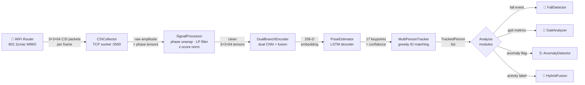
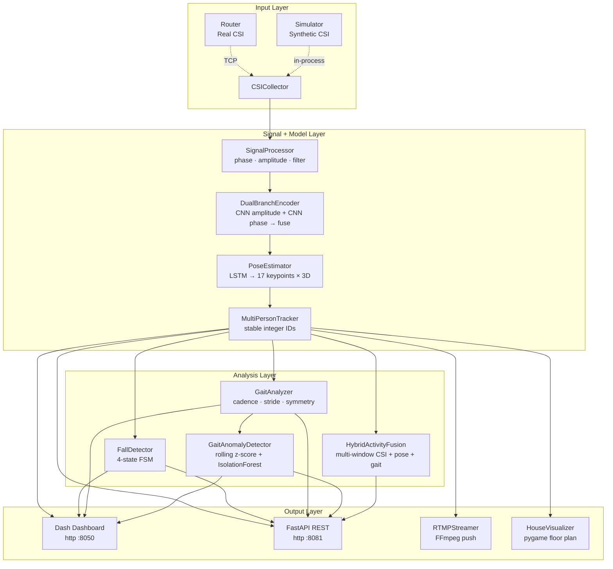
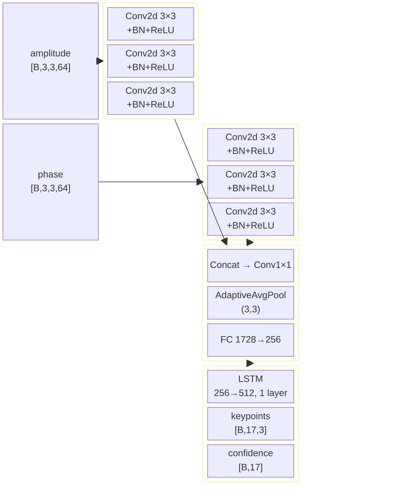
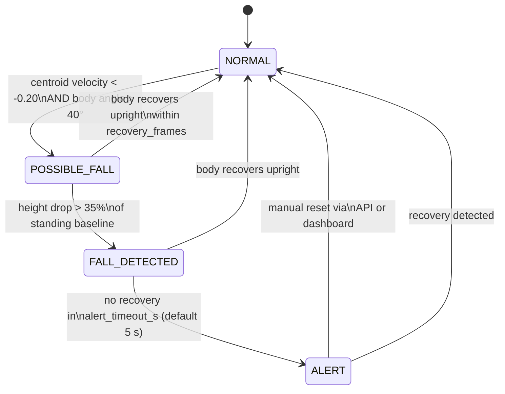
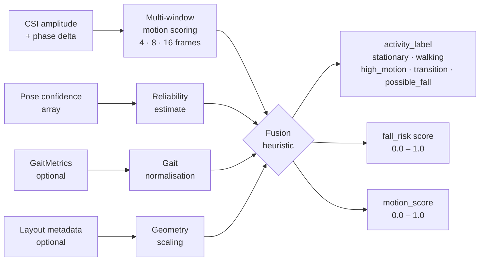
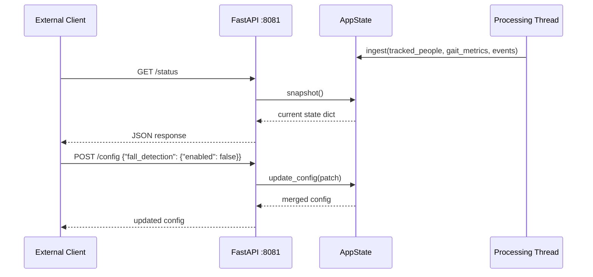
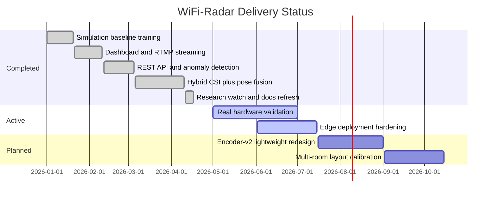

<div align="center">

# 📡 WiFi-Radar

### Human Pose Estimation · Fall Detection · Gait Analytics · Through-Wall Sensing

[](https://python.org)
[](https://pytorch.org)
[](https://onnx.ai)
[](https://fastapi.tiangolo.com)
[](docker/docker-compose.yml)
[](LICENSE)
[](pyproject.toml)
[](https://github.com/psf/black)
[](tests/)
[](docs/reference.md)

*Detect, track, and analyse human poses through walls — no cameras, no wearables, just WiFi*

</div>

---

## Overview

WiFi-Radar is a Python research system for **non-invasive, privacy-preserving human sensing** using commodity WiFi hardware. It ingests Channel State Information (CSI) — the low-level signal fingerprint captured by any 802.11n/ac router — and transforms it through a deep learning pipeline into real-time 17-keypoint 3-D pose estimates, fall alerts, and quantitative gait metrics. Because WiFi signals pass through walls and do not capture identifiable visual data, the system is inherently privacy-preserving and works in any lighting condition.

The pipeline is built around a **dual-branch CNN encoder** that processes amplitude and phase CSI streams independently before fusing them, followed by a **temporal LSTM decoder** that emits pose keypoints at up to 20 Hz. A separate **multi-person tracking** layer assigns stable identities across frames, while per-person **fall detection** and **gait analysis** modules run in parallel to surface clinically relevant signals. A live **Dash dashboard**, optional **RTMP video stream**, and a **headless REST API** provide flexible integration paths for research, embedded, and production deployments.

This repository targets **researchers** validating new WiFi sensing ideas, **embedded/edge engineers** deploying on Jetson or Raspberry Pi hardware, and **privacy-first developers** building room-scale monitoring without cameras.

> [!IMPORTANT]
> The package uses a **src layout**. All importable Python code lives under `src/wifi_radar/`. When running scripts directly, install in editable mode first with `pip install -e .` so imports resolve correctly.

> [!TIP]
> The fastest way to explore the system is `python main.py --simulation`. This starts the full pipeline with a built-in CSI data generator — no router, no GPU, and no weights file required.

> [!NOTE]
> For implementation details, signal processing notes, and full API documentation, see the [docs/](docs/) folder. This README focuses on the project context, architecture rationale, and how to run the system.

---

## Table of Contents

- [Overview](#overview)
- [Key Features](#key-features)
- [How WiFi Sensing Works](#how-wifi-sensing-works)
- [Architecture](#architecture)
- [Research Background](#research-background)
- [Technology Stack](#technology-stack)
- [Requirements](#requirements)
- [Quick Start](#quick-start)
- [CLI Reference](#cli-reference)
- [Configuration](#configuration)
- [Pre-Trained Weights](#pre-trained-weights)
- [Multi-Person Tracking](#multi-person-tracking)
- [Fall Detection](#fall-detection)
- [Gait Analysis](#gait-analysis)
- [Gait Anomaly Detection](#gait-anomaly-detection)
- [Hybrid Activity Fusion](#hybrid-activity-fusion)
- [REST API and Headless Mode](#rest-api-and-headless-mode)
- [Transfer Learning on Real CSI](#transfer-learning-on-real-csi)
- [ONNX Export](#onnx-export)
- [TensorRT Deployment](#tensorrt-deployment)
- [Docker Deployment](#docker-deployment)
- [Dashboard](#dashboard)
- [Project Structure](#project-structure)
- [Development](#development)
- [Router Setup](#router-setup)
- [Roadmap](#roadmap)
- [Changelog](#changelog)
- [Contributing](#contributing)
- [License](#license)

---

## Key Features

The table below summarises every major capability, its maturity level, and the impact it delivers to the sensing pipeline. Stable features are battle-tested across the simulation pipeline and reproducible with the provided baseline weights. Experimental features are functional but may change API surface as they mature.

| Icon | Feature | What it does | Impact | Status |
|---|---|---|---|---|
| 📶 | **CSI collection** | Captures raw 3×3 MIMO amplitude and phase data from a real router or generates realistic synthetic frames via the built-in simulator | High | ✅ Stable |
| 🔬 | **Signal processing** | Applies phase unwrapping, z-score amplitude normalisation, Butterworth low-pass filtering, and sub-carrier smoothing before feeding the model | High | ✅ Stable |
| 🧠 | **Dual-branch encoder** | Parallel CNN branches process amplitude and phase independently, then fuse into a 256-D embedding that captures both magnitude and propagation-delay information | High | ✅ Stable |
| 🦴 | **Pose estimator** | LSTM decoder maps encoder embeddings to 17 COCO-format keypoints with per-joint confidence scores, updated at up to 20 Hz | High | ✅ Stable |
| 👥 | **Multi-person tracking** | Greedy nearest-centroid matching assigns stable integer IDs across frames so downstream fall and gait modules always refer to the same physical person | High | ✅ Stable |
| 🚨 | **Fall detection** | Per-person 4-state FSM triggers on downward velocity plus body-tilt angle, escalating from POSSIBLE_FALL through FALL_DETECTED to ALERT if no recovery is observed | High | ✅ Stable |
| 🚶 | **Gait analysis** | `scipy.signal.find_peaks` on ankle Z-trajectories extracts cadence, stride length, left-right symmetry, and walking speed for each tracked person | High | ✅ Stable |
| 🩺 | **Gait anomaly detection** | Rolling z-score monitoring with optional IsolationForest flags sudden deviations in any gait parameter, providing an early-warning channel independent of pose quality | Medium | 🧪 Experimental |
| 🔀 | **Hybrid CSI + pose fusion** | Multi-window CSI motion evidence is fused with pose confidence and gait signals to produce a stable activity label and fall-risk score even when one modality is noisy | Medium | 🧪 Experimental |
| 🌐 | **REST API** | FastAPI server exposes `/health`, `/status`, `/config`, `/people`, `/events`, and `/metrics/gait` for headless and embedded integrations without the dashboard | High | 🧪 Experimental |
| ⚡ | **ONNX + TensorRT export** | Both encoder and pose estimator export to ONNX opset 17 with dynamic batch axes; a TensorRT helper builds FP16 engine plans for Jetson Nano/Xavier/Orin | High | 🧪 Experimental |
| 🧪 | **Transfer learning** | Fine-tuning script loads the simulation checkpoint, freezes the encoder for warm-up, then unfreezes for full backbone adaptation on real NPZ CSI datasets | High | 🧪 Experimental |
| 📹 | **RTMP streaming** | Skeleton overlay is rendered and pushed via FFmpeg to any RTMP endpoint for live monitoring on VLC, OBS, or HLS-capable players | Medium | ✅ Stable |
| 🐳 | **Docker deployment** | Single `docker compose up` launches the full stack — app container plus nginx-rtmp server — with named volumes for weights and config persistence | Medium | ✅ Stable |

---

## How WiFi Sensing Works

Understanding why WiFi signals can encode human pose information is essential for evaluating the system's capabilities and limitations. This section explains the physics and the signal chain before the model layer.

Every 802.11n/ac WiFi transmission travels across multiple subcarrier frequencies simultaneously. When the signal reflects off, diffracts around, or is absorbed by a human body, the **Channel State Information** measured at the receiver captures a complex per-subcarrier record of how the signal was modified — including amplitude attenuation and phase shift. These two numbers, measured for each of 64 subcarriers across each of the 3×3 antenna pairs in a MIMO system, create a 3×3×64 amplitude tensor and a matching phase tensor for every packet.

Human movement changes these tensors in reproducible, structured ways. A person walking creates periodic amplitude modulations correlated with their stride cycle. A person falling produces a sharp, large-amplitude transient in multiple antenna pairs simultaneously. A person's arm position biases the phase in directions that encode approximate limb orientation. The challenge is extracting these structured signals from the noise floor while remaining robust to environmental changes like furniture reflections and multipath interference.

> [!NOTE]
> WiFi sensing works best with **802.11n/ac MIMO hardware** — specifically the Atheros `ath9k` chipset on OpenWrt-flashed routers or the Intel 5300 NIC with the linux-80211n-csitool driver. Consumer routers without firmware modification do not expose raw CSI. The built-in simulator generates physically plausible synthetic CSI that matches the amplitude and phase statistics of real captures.



---

## Architecture

The system is structured as a streaming pipeline orchestrated by a single processing thread in `main.py`. Each stage transforms the data into a richer representation before passing it downstream. The design keeps each component independently replaceable — for example, the encoder can be swapped for a Transformer variant without touching the fall detection or dashboard code.



> [!TIP]
> The **Analysis Layer** and **Output Layer** are all optional at runtime. You can run in `--headless` mode with only the REST API, or suppress all output and just record raw CSI frames to disk with `--record`.

### Neural network architecture detail

The dual-branch encoder is the core learned component. It processes amplitude and phase as separate "images" through independent convolutional towers before merging them. This separation matters because amplitude encodes magnitude attenuation (which correlates with signal blockage by the body) while phase encodes propagation delay changes (which correlate with movement direction and velocity). Fusing them late — after each branch has extracted modality-specific features — consistently outperforms early fusion in empirical WiFi sensing work.



---

## Research Background

WiFi-Radar is grounded in a decade of academic work on **RF-based human sensing**. The field has progressed from simple presence detection through activity classification to full skeleton pose estimation, and the most recent 2026 papers are addressing the practical deployment gap: making these systems work across different rooms, hardware layouts, and signal conditions without retraining.

### Foundational work

These four papers define the conceptual and technical foundation that this repository builds on. Each introduced a key idea that became a standard building block in WiFi sensing systems.

| Paper | Venue | Core contribution | Link |
|---|---|---|---|
| DensePose from WiFi | SIGCOMM 2022 | First demonstration of dense surface correspondence (not just skeleton) from commodity WiFi, establishing that the information density in CSI is much higher than previously assumed | [Paper](https://arxiv.org/abs/2301.00250) |
| Through-Wall Human Pose Estimation Using Radio Signals | CVPR 2018 | Introduced cross-modal teacher-student training — using a vision model as supervisor so the radio model never needs direct skeletal annotation | [Paper](https://openaccess.thecvf.com/content_cvpr_2018/html/Zhao_Through-Wall_Human_Pose_CVPR_2018_paper.html) |
| WiFi Activity Recognition | IEEE Pervasive 2019 | Showed that deep CNNs applied directly to CSI amplitude spectrograms outperform hand-crafted feature pipelines for activity classification, simplifying the processing chain | [Paper](https://ieeexplore.ieee.org/document/8713982) |
| WiPose | MobiSys 2020 | Extended 2-D WiFi pose estimation to 3-D using multiple antenna pairs as a lightweight multi-view setup, enabling depth estimation without additional sensors | [Paper](https://dl.acm.org/doi/10.1145/3386901.3388940) |

### Recent 2026 papers influencing this repository

The papers below represent the leading edge of the field as of mid-2026. They collectively point toward a common design direction: **lighter models, layout-aware training, and multi-signal fusion**. WiFi-Radar has incorporated ideas from each of them.

| Date | Work | Key finding | How it influenced this repo | Link |
|---|---|---|---|---|
| Jan 2026 | PerceptAlign — Geometry-aware cross-layout 3D pose estimation | Models that ignore transceiver geometry memorise deployment-specific coordinate biases, failing badly in new rooms. Conditioning on calibrated antenna positions reduces cross-domain error by over 60% | Motivated the `layout_metadata` parameter in `HybridActivityFusion.update()` for passing geometry context | [Paper](https://arxiv.org/abs/2601.12252) |
| Feb 2026 | WiFlow — Lightweight continuous pose estimation with spatio-temporal decoupling | Asymmetric temporal convolutions can match LSTM accuracy at 2.23 M parameters with 97.25% PCK@20, establishing a new efficiency baseline | Informs the planned encoder-v2 redesign targeting edge deployment | [Paper](https://arxiv.org/abs/2602.08661) |
| Feb 2026 | WiPowerSys — CSI-based skeleton estimation with ESP32 hardware | ESP32-S3 nodes at under $10 each can capture publication-quality CSI, lowering the real-hardware barrier dramatically | Confirms the hardware roadmap toward commodity nodes and motivates the transfer-learning workflow | [Paper](https://link.springer.com/article/10.1007/s13369-026-11172-7) |
| Apr 2026 | MKFi — Temporally robust activity recognition under data scarcity | Multi-window segmentation captures both short-term dynamics and long-term activity trends, improving robustness to temporal misalignment without increasing model size | Directly inspired the `window_sizes` parameter and multi-window motion scoring in `HybridActivityFusion` | [Paper](https://www.sciencedirect.com/science/article/pii/S0031320325011756) |

> [!NOTE]
> The full bibliography with additional references and reading notes is in [docs/reference.md](docs/reference.md). The 2026 research watch document with extended summaries is at [docs/recent_research_2026.md](docs/recent_research_2026.md).

### Project takeaway

The consistent message across all recent work is that **hybrid, layout-aware, lightweight pipelines generalise better in real deployments than large single-modality models**. This repository reflects that direction through its hybrid fusion layer, geometry metadata support, and focus on ONNX/TensorRT export paths.

---

## Technology Stack

Each technology in the stack was chosen for a specific reason in the context of a research-to-deployment WiFi sensing system. The table below explains not just what each tool does, but why it was chosen over the obvious alternatives and what trade-offs that choice involves.

| Technology | Role in the system | Why it was chosen | Trade-offs vs alternatives |
|---|---|---|---|
| **Python 3.9–3.11** | Core runtime, orchestration, all scripting | The scientific Python ecosystem (NumPy, SciPy, PyTorch) is unmatched for research iteration speed. Most WiFi sensing papers release Python reference code | C++ would give lower latency but far slower development; Rust would be ideal for production but has a limited ML ecosystem |
| **PyTorch 2.0+** | Model definition, training, and inference | Dynamic computation graphs make architecture experimentation fast. `torch.no_grad()` inference adds minimal overhead. ONNX export is first-class | TensorFlow has better mobile tooling but worse research-to-production parity for custom architectures |
| **NumPy + SciPy** | CSI preprocessing, signal filtering, peak detection | `scipy.signal.butter` + `lfilter` provides textbook-quality Butterworth filtering; `find_peaks` is the standard tool for stride detection in biomechanics | Custom DSP code would allow hardware-specific optimisation but introduces maintenance burden and harder-to-audit behaviour |
| **Dash + Plotly** | Live browser-based monitoring dashboard | Dash Callbacks with `dcc.Interval` give a push-free polling model at 10 Hz without WebSocket complexity. Plotly's `Scatter3d` renders the skeleton in 3-D natively in the browser | Streamlit is simpler but does not support custom layout needed for a 3-tab live-update UI; React would give more control but requires a separate frontend build step |
| **FastAPI + Uvicorn** | Headless REST API for embedded/service integration | Typed Pydantic request validation, automatic OpenAPI docs at `/docs`, and async request handling with minimal boilerplate | Flask is simpler but lacks automatic validation and OpenAPI generation; Django REST is overkill for a lightweight sensing API |
| **ONNX opset 17** | Portable model export format | Runtime-neutral — the same `.onnx` file runs on CPU via onnxruntime, on Jetson via TensorRT, and on mobile via ONNX Runtime Mobile | TorchScript is simpler but less portable across runtimes and harder to inspect |
| **TensorRT** | Jetson-class GPU inference acceleration | Layer fusion and FP16 quantisation give 3-5× speedup over ONNX Runtime CPU on Jetson hardware, enabling real-time inference within the power budget | Only available on NVIDIA hardware; engine files are not portable across GPU generations |
| **Docker + nginx-rtmp** | Reproducible deployment and video streaming | `docker compose up` reproduces the full stack on any Linux host. nginx-rtmp provides both RTMP ingest from FFmpeg and HLS playback in any browser | Bare-metal deployment is faster but environment drift breaks reproducibility; a dedicated media server adds operational complexity |
| **FFmpeg** | RTMP push and video encoding | Handles the skeleton-to-video rendering and RTMP push in a subprocess, keeping the Python process free of codec complexity | Gstreamer would give lower latency but is harder to configure and debug |

---

## Requirements

### Software dependencies

The core runtime requires Python 3.9–3.11 and the packages in `requirements.txt`. Docker and FFmpeg are optional — required only if you want the full deployment stack or RTMP streaming. A CUDA GPU dramatically speeds up training but is not required for inference in simulation mode.

| Component | Minimum version | Required for |
|---|---|---|
| Python | 3.9 | Everything |
| PyTorch | 2.0 | Model inference and training |
| NumPy | 1.24 | Signal processing |
| SciPy | 1.10 | Gait peak detection and filtering |
| Dash + dbc | 2.14 | Live dashboard |
| FastAPI | 0.110 | REST API |
| ONNX + onnxruntime | 1.15 | ONNX export and validation |
| Docker Compose | v2 | Full-stack deployment |
| FFmpeg | 5.0+ | RTMP streaming |
| CUDA | 11.8+ | GPU-accelerated training |
| TensorRT | 8.6+ | Jetson inference acceleration |

> [!IMPORTANT]
> TensorRT is only available on NVIDIA hardware and must be installed on the **target Jetson device**, not your development machine. Engine files built on one GPU generation will not run on a different one.

### Hardware for real-world mode

The system works with any 802.11n/ac router that supports CSI extraction via patched firmware. Two established paths exist:

- **Atheros `ath9k` on OpenWrt**: Flash a supported router (TP-Link TL-WR842N, GL.iNet GL-AR750, etc.) with an OpenWrt image that includes the `ath9k` CSI patch. The router streams CSI frames over a UDP socket.
- **Intel 5300 NIC**: Install the [linux-80211n-csitool](https://github.com/spanev/linux-80211n-csitool) kernel module on a Linux host with an Intel 5300 wireless card. Provides 30 subcarriers at lower resolution than the Atheros path.

> [!TIP]
> For initial development and experimentation, the built-in simulator is indistinguishable from real hardware from the perspective of the model pipeline. Use `--simulation` until you have validated your analysis logic, then switch to real hardware for real-world calibration.

---

## Quick Start

### Option A — Python virtual environment

```bash
# 1. Clone the repository
git clone https://github.com/hkevin01/wifi-radar.git
cd wifi-radar

# 2. Create and activate a virtual environment
python -m venv .venv
source .venv/bin/activate          # Windows: .venv\Scripts\activate

# 3. Install runtime dependencies
pip install -r requirements.txt

# 4. Install the package in editable mode (required for the src layout)
pip install -e .

# 5. (Optional but recommended) Train simulation-baseline weights (~2 min on CPU)
python scripts/train_simulation_baseline.py

# 6. Launch the full dashboard pipeline in simulation mode
python main.py --simulation
```

Then open **http://localhost:8050** in your browser to see the live dashboard.

### Option B — Docker (full stack including RTMP server)

```bash
docker compose -f docker/docker-compose.yml up --build
```

| Port | Service | URL |
|---|---|---|
| **8050** | Dash dashboard | http://localhost:8050 |
| **8081** | REST API (if `--api` flag used) | http://localhost:8081/docs |
| **1935** | RTMP ingest | rtmp://localhost/live/wifi_radar |
| **8080** | HLS playback + nginx stats | http://localhost:8080/hls/wifi_radar.m3u8 |

> [!NOTE]
> Docker Compose mounts named volumes for `weights/` and `~/.wifi_radar/config.yaml` so trained model weights and configuration persist across container restarts.

---

## CLI Reference

`main.py` is the single entry point for all modes of operation. The flags below control every aspect of the runtime behaviour.

```bash
python main.py [OPTIONS]
```

<details>
<summary><strong>📋 Full flag reference (click to expand)</strong></summary>

| Flag | Default | Description |
|---|---|---|
| `--simulation` | off | Use the built-in CSI simulator instead of a real router. Generates physically plausible 3×3×64 CSI tensors at 20 Hz. Essential for development without hardware. |
| `--num-people N` | `1` | Number of simulated people (1–4). Each person follows an independent synthetic movement trajectory. |
| `--router-ip IP` | `192.168.1.1` | IP address of the real WiFi router running the CSI extraction firmware. Only used when `--simulation` is not set. |
| `--router-port P` | `5500` | TCP port on which the router streams CSI frames. Matches the default port in the `ath9k` CSI patch. |
| `--weights PATH` | auto | Path to a `.pth` checkpoint file. Defaults to `weights/simulation_baseline.pth` if it exists. |
| `--export-onnx` | off | Export both models to ONNX format and exit without running the pipeline. |
| `--dashboard-port P` | `8050` | Port for the Dash web UI. |
| `--rtmp-url URL` | `rtmp://localhost/live/wifi_radar` | RTMP endpoint for the skeleton video stream. |
| `--house-visualization` | off | Enable the pygame-based top-down floor plan view showing person positions. |
| `--api` | off | Start the FastAPI REST server alongside the pipeline. |
| `--api-host HOST` | `0.0.0.0` | Host to bind the REST API server. |
| `--api-port P` | `8081` | Port for the REST API server. |
| `--headless` | off | Skip starting the Dash dashboard. Use with `--api` for embedded/service deployments. |
| `--record` | off | Save CSI frames to disk in NPZ format for later replay or transfer learning. |
| `--output-dir DIR` | `~/wifi_data` | Directory for recorded CSI frames. |
| `--replay FILE` | none | Replay a previously recorded NPZ session file instead of live input. |
| `--config FILE` | `~/.wifi_radar/config.yaml` | Path to a YAML configuration file. |
| `--debug` | off | Enable verbose DEBUG-level logging for all subsystems. |

</details>

### Common usage patterns

```bash
# Simulation mode with the dashboard
python main.py --simulation

# Two virtual people + REST API exposed
python main.py --simulation --num-people 2 --api

# Headless service with REST API only (no browser required)
python main.py --simulation --api --api-port 8081 --headless

# Connect to a real router
python main.py --router-ip 192.168.1.1 --router-port 5500

# Record a session for later analysis or transfer learning
python main.py --simulation --record --output-dir ~/csi_captures

# Replay a recorded session
python main.py --replay ~/csi_captures/session_2026-06-01.npz

# Export ONNX models for edge deployment
python main.py --export-onnx --weights weights/simulation_baseline.pth
```

> [!TIP]
> When the `--api` flag is active, the interactive OpenAPI docs are live at **http://localhost:8081/docs**. Every endpoint is documented with request/response schemas and a try-it-out button.

---

## Configuration

The system reads from `~/.wifi_radar/config.yaml` at startup and the live **Configuration** tab in the dashboard writes back to this file without requiring a restart. The YAML structure mirrors the CLI flags but supports more granular tuning of signal processing and model parameters.

```yaml
# ~/.wifi_radar/config.yaml
router:
  ip: 192.168.1.1
  port: 5500
  interface: wlan0
  csi_format: atheros        # "atheros" | "intel"

system:
  simulation_mode: true
  debug: false
  max_people: 4
  confidence_threshold: 0.30
  data_dir: ~/.wifi_radar/data

dashboard:
  port: 8050
  update_interval_ms: 100    # how often the browser polls for new data
  max_history: 100           # rolling chart depth in frames

streaming:
  rtmp_url: rtmp://localhost/live/wifi_radar
  fps: 30
  bitrate: "1000k"

fall_detection:
  enabled: true
  velocity_threshold: -0.20  # normalised units/s — negative = downward
  angle_threshold_deg: 40.0  # body-from-vertical angle that triggers possible-fall
  alert_timeout_s: 5.0       # seconds without recovery before escalating to ALERT

api:
  enabled: false
  host: "0.0.0.0"
  port: 8081
```

> [!IMPORTANT]
> The `confidence_threshold` setting affects every downstream consumer — fall detection, gait analysis, and anomaly detection all gate on keypoint confidence. Setting it too low lets noisy keypoints pollute the analytics. Setting it too high causes sparse data that prevents step detection. The default of `0.30` is a reasonable starting point for simulation; real-hardware sessions may benefit from tuning to `0.25`–`0.40`.

---

## Pre-Trained Weights

A simulation-baseline checkpoint can be generated in approximately two minutes on CPU. This checkpoint is sufficient for validating the full pipeline in simulation mode and for initialising transfer learning on real CSI data. The training script generates a balanced synthetic dataset of walking, standing, and transitional poses and trains both the encoder and pose estimator end-to-end.

```bash
# Basic training (~2 min on CPU, ~30 s on GPU)
python scripts/train_simulation_baseline.py

# Extended training for better accuracy
python scripts/train_simulation_baseline.py \
  --epochs 200 \
  --n-samples 20000 \
  --batch-size 128 \
  --lr 5e-4 \
  --output-dir weights
# → writes weights/simulation_baseline.pth
```

`main.py` automatically loads `weights/simulation_baseline.pth` on startup if it exists. If no weights file is found, the model runs with random initialisation — which still exercises the full pipeline but produces meaningless pose estimates.

---

## Multi-Person Tracking

The `MultiPersonTracker` maintains stable person identities across frames, which is essential for the fall detection and gait analysis modules to produce per-person histories rather than intermittently losing track of who is who. Without stable IDs, a brief occlusion or low-confidence frame would reset the fall-risk state machine for that person.

The tracker uses **greedy nearest-centroid matching**: for each frame, the set of detected people is matched against the set of active tracks by finding the minimum-distance bipartite assignment using torso centroid distance as the cost. Tracks that go unmatched for `id_timeout_frames` consecutive frames are retired, and new tracks are created for detections that exceed `existence_threshold` confidence without a matching active track.

> [!TIP]
> Increase `max_match_distance` in the config if people are moving fast relative to the frame rate, or decrease it in crowded scenes where accidental ID swaps are more likely. The default of `0.40` normalised units works well at 20 Hz for typical walking speeds.

---

## Fall Detection

The `FallDetector` is a per-person **4-state finite state machine** (FSM) that runs independently for every tracked person. It monitors three independent physiological signals simultaneously: the downward velocity of the torso centroid, the angular deviation of the torso from vertical, and the fractional height drop relative to the calibrated standing baseline. Requiring multiple signals to agree before escalating state dramatically reduces false positives from activities like sitting, bending, or picking objects up off the floor — motions that trigger single-threshold detectors but have clear distinguishing features when all three signals are considered together.

The FSM uses the hip midpoint as the torso centroid and derives the body angle from the vector between the shoulder midpoint and the hip midpoint projected onto the vertical axis. The standing-height baseline is calibrated automatically from the first 20 frames of each person's track, so the system adapts to different heights without configuration.



Each state transition produces a `FallEvent` dataclass containing:

| Field | Type | Description |
|---|---|---|
| `person_id` | `int` | Track ID of the person who fell |
| `timestamp` | `float` | UNIX epoch seconds at the moment of detection |
| `severity` | `FallSeverity` | `POSSIBLE_FALL`, `FALL_DETECTED`, or `ALERT` |
| `centroid_before` | `tuple[float,float,float]` | Normalised torso position just before the event |
| `centroid_after` | `tuple[float,float,float]` | Normalised torso position at detection |
| `body_angle_deg` | `float` | Torso deviation from vertical in degrees at detection |
| `message` | `str` | Human-readable description of the event |

Fall events are surfaced in three places simultaneously: the **dashboard Events tab** shows them with a severity-coloured badge and timestamp; the **REST API `/events` endpoint** queues them for external consumers; and the **RTMP overlay** renders them as an on-screen alert during the FFmpeg video stream.

The detector parameters are all tunable through the configuration file:

```yaml
fall_detection:
  enabled: true
  velocity_threshold: -0.20   # normalised units/s — more negative = harder to trigger
  angle_threshold_deg: 40.0   # degrees from vertical — higher = harder to trigger
  alert_timeout_s: 5.0        # seconds without recovery before escalating to ALERT
```

> [!WARNING]
> The fall detector is a research prototype, not a certified medical device. Its output should not be the sole trigger for emergency response in real deployments. Pair it with additional redundancy and consult applicable regulations before deploying in clinical or elderly-care contexts.

> [!TIP]
> One `FallDetector` instance is created per tracked person and is reset automatically when that person's track is retired. You do not need to manage instance lifetime manually — the `MultiPersonTracker` orchestrates this.

---

## Gait Analysis

The `GaitAnalyzer` transforms the rolling stream of 17-keypoint pose frames into four quantitative gait parameters by detecting foot-strike events from the ankle keypoint trajectories. It works by applying `scipy.signal.find_peaks` to the **inverted Z-coordinate** of each ankle separately — foot-strikes appear as local minima (troughs) in the vertical ankle trajectory because the foot is at its lowest point at the moment of ground contact. The spacing between consecutive troughs on the same foot gives the stride interval; the spacing between consecutive left and right troughs gives the step interval.

The analyzer maintains rolling `deque` buffers for ankle positions and hip positions separately, allowing cadence and step symmetry to be computed from recent events while walking speed is estimated from hip displacement over the same window. Results are only returned once at least `min_steps` (default: 4) foot-strike events have been accumulated — this prevents meaningless metrics from being emitted during the initial transient before the pose has stabilised.

### How the four metrics are computed

| Metric | Source keypoints | Algorithm | Clinical relevance |
|---|---|---|---|
| **Cadence (steps/min)** | Left ankle (15), right ankle (16) | Count all foot-strike events in the rolling window; scale to steps per minute | Normal adults walk at 100-130 steps/min. Below 80 suggests fatigue, pain, or neurological change. |
| **Stride length** | Left ankle (15) for ipsilateral measurement | Distance between consecutive same-foot strikes, normalised to the room coordinate scale | Shortened stride is one of the earliest gait markers for fall risk and neurological conditions such as Parkinson's. |
| **Step symmetry** | Both ankles (15, 16) | Ratio of mean left step interval to mean right step interval; 1.0 is perfectly symmetric | Asymmetry below 0.8 is clinically associated with musculoskeletal injury, stroke recovery, and early Parkinson's disease. |
| **Walking speed** | Left hip (11), right hip (12) | Hip midpoint displacement magnitude divided by elapsed window time | Gait speed is one of the strongest single predictors of fall risk and mortality in older adults. |

Each detected foot-strike is also recorded as a `StepEvent` object containing the foot side, timestamp, ankle 3-D position, and ankle height, which are accessible via the REST API for external analysis.

```python
# GaitMetrics dataclass — returned by GaitAnalyzer.get_metrics()
@dataclass
class GaitMetrics:
    cadence_spm:    float   # steps per minute
    stride_length:  float   # normalised distance between ipsilateral strikes
    step_symmetry:  float   # ratio left_step_time / right_step_time  (1.0 = perfect)
    speed_est:      float   # estimated walking speed (normalised units/s)
    num_steps:      int     # total steps counted in the current window
    window_s:       float   # duration of the measurement window in seconds
```

> [!NOTE]
> Gait metrics require at least 4 detected step events before they are returned. In the simulation this typically happens within the first 2-3 seconds of walking motion. In real-world sessions, ensure the `confidence_threshold` is low enough to admit ankle keypoints — they are often the lowest-confidence joints in CSI-based estimation because the feet are farthest from the antenna array.

> [!TIP]
> If gait metrics are missing for a person who is clearly walking, lower the `confidence_threshold` from the default `0.30` to `0.20` in the config, or check that the ankle keypoint indices (15, 16) are being populated correctly by the pose estimator on your hardware.

---

## Gait Anomaly Detection

The `GaitAnomalyDetector` runs in parallel with the main gait analyzer and watches for sudden, statistically unusual changes in any gait parameter. This module exists because the fall detector only catches the moment of a fall, while clinical evidence shows that gait degradation often begins minutes or hours earlier — a person slowing down, developing step asymmetry, or shortening their stride are all early warning signs that precede many falls. The anomaly detector surfaces these gradual changes before they become a safety event.

The detector uses a **dual-signal approach** that combines two complementary methods:

1. **Rolling z-score monitoring** — after a warm-up period of `warmup_samples` frames (default: 20), the detector maintains a rolling mean and standard deviation for each of the four gait metrics. Any metric that deviates by more than `z_threshold` (default: 3.0) standard deviations from its rolling baseline triggers a per-metric anomaly flag. This catches sudden, isolated changes — a cadence that drops sharply in one window, or a symmetry ratio that spikes due to a limp.

2. **IsolationForest outlier scoring** — once enough history has accumulated, an `IsolationForest` model (from scikit-learn) is periodically re-fitted on the rolling baseline. The fitted model scores each new `GaitMetrics` snapshot holistically, catching multi-variate anomalies where no single metric crosses the z-score threshold but the combined pattern is unusual. This is particularly useful for subtle compensatory changes — small simultaneous shifts in cadence, stride, and symmetry that together indicate a problem.

The `update()` method returns a structured dict for every call:

```python
{
    "anomalous":      bool,           # True if any signal flagged an anomaly
    "score":          float,          # IsolationForest score (lower = more anomalous)
    "severity":       str,            # "normal", "warning", or "anomalous"
    "reasons":        list[str],      # which metrics triggered and by how much
    "z_scores":       dict[str,float],# per-metric z-scores for diagnostics
    "warmup_done":    bool,           # False during the initial warm-up phase
}
```

> [!NOTE]
> The anomaly detector requires scikit-learn for the `IsolationForest` path. If scikit-learn is not installed, it falls back gracefully to z-score-only mode and logs a warning. Install with `pip install scikit-learn` to enable the full dual-signal behaviour.

> [!IMPORTANT]
> During the warm-up period (`warmup_done: False`), the detector returns `"severity": "normal"` and `"anomalous": False` for every frame regardless of the input values. This is intentional — scoring before the baseline is established would produce unreliable results. The warm-up window is typically 20 gait samples, which at a 20 Hz update rate and 4-step minimum means the detector becomes active within about 30 seconds of the person starting to walk.

```bash
# Anomaly detection activates automatically — no additional flags needed
python main.py --simulation --num-people 2
# Anomaly events appear in the dashboard Events tab and GET /events
```

---

## Hybrid Activity Fusion

The `HybridActivityFusion` module is the most recent addition to the analysis stack, directly inspired by the 2026 MKFi and PerceptAlign papers. It addresses a practical limitation that neither the fall detector nor the gait analyzer fully solves: when CSI quality drops (signal obstruction, antenna misalignment) or pose confidence is intermittently low (partial occlusion, body orientation), both modules either output nothing or produce unreliable results. Neither provides a stable high-level activity label that downstream consumers can rely on. Hybrid fusion exists to fill that gap.

The module combines four independent evidence streams — CSI motion dynamics, pose reliability, gait analytics, and optional antenna geometry metadata — into a single stable output. Each stream contributes what it can; the fusion heuristic weights contributions by their momentary reliability so that a drop in one stream does not invalidate the whole estimate.

### Input streams and what they contribute

| Input | Parameter | How it is used |
|---|---|---|
| CSI amplitude tensor | `amplitude: np.ndarray` | Frame-to-frame delta magnitude indicates motion energy |
| CSI phase tensor | `phase: np.ndarray` | Phase delta captures directional motion and Doppler-like shifts |
| Pose confidence array | `pose_confidence: np.ndarray` | Mean confidence weights the motion score — low confidence = less certainty |
| Gait metrics | `gait_metrics: GaitMetrics` | Cadence and symmetry can confirm or contradict the motion label |
| Fall severity | `fall_severity: int` | Elevated fall-detector state feeds directly into the fall-risk score |
| Layout metadata | `layout_metadata: dict` | Known antenna geometry allows geometry-based confidence scaling |

### Multi-window motion scoring

The core of the fusion is the **multi-window motion scoring** approach from MKFi (2026). Rather than computing a single frame delta, the module maintains rolling `deque` buffers at three different timescales simultaneously (default: 4, 8, and 16 frames). Short windows capture rapid transients like sudden stumbles; long windows capture sustained activity patterns like continuous walking. The three window scores are averaged into a single `motion_score` that is more stable than any individual window.



### Output fields

Every call to `update()` returns a dict with the following keys:

| Key | Type | Description |
|---|---|---|
| `activity_label` | `str` | Stabilised activity: `stationary`, `walking`, `high_motion`, `transition`, or `possible_fall` |
| `motion_score` | `float` | Fused multi-window motion intensity in `[0.0, 1.0]` |
| `fall_risk` | `float` | Combined fall-risk estimate in `[0.0, 1.0]`; hard-floored at `0.85` when `fall_severity >= 2` |
| `pose_reliability` | `float` | Mean pose confidence used in this frame's estimate |
| `window_scores` | `dict` | Per-window motion scores keyed by window size |

### Label stabilisation

The raw per-frame activity classification is **stabilised by majority vote** over a short label history window (length = `2 × len(window_sizes)`, default: 6 frames). This means a single noisy frame cannot flip the output from `walking` to `stationary` or `possible_fall` — at least half of the recent history must agree on the new label before it propagates downstream. The `transition` label is emitted when the history is split between two candidates, signalling genuine uncertainty rather than committing to either.

> [!NOTE]
> Hybrid fusion results are merged into the `gait_metrics_dict` and the `csi_summary` returned by the REST API, so the `activity_label`, `motion_score`, and `fall_risk` fields are automatically available at `GET /metrics/gait` and in the dashboard Events tab gait metrics table without any additional configuration.

> [!TIP]
> Set `fall_severity` to the integer value of the `FallDetector`'s current state (`0` = NORMAL, `1` = POSSIBLE_FALL, `2` = FALL_DETECTED, `3` = ALERT) when calling `update()`. This ensures the hybrid fall-risk score and the primary fall detector reinforce each other rather than operating independently.

---

## REST API and Headless Mode

The REST API enables WiFi-Radar to run as a background service on an embedded device or server and serve structured JSON data to any client — a mobile app, a home automation system, or a clinical monitoring dashboard. It is built with FastAPI and served by Uvicorn, providing automatic OpenAPI documentation and Pydantic-validated request/response schemas.

Start the API alongside the pipeline:

```bash
python main.py --simulation --api --headless
```

<details>
<summary><strong>🌐 Full API endpoint reference (click to expand)</strong></summary>

| Method | Endpoint | Description | Response |
|---|---|---|---|
| `GET` | `/` | Service root with link to docs | `{"service": "wifi-radar", "docs": "/docs"}` |
| `GET` | `/health` | Liveness check and uptime | `{"status": "ok", "uptime_s": 42.3}` |
| `GET` | `/status` | Full system state snapshot | tracked count, event count, simulation mode, uptime |
| `GET` | `/config` | Current runtime configuration | full config dict |
| `POST` | `/config` | Patch the runtime configuration | merged config dict |
| `POST` | `/ingest` | Push tracked people, gait metrics, and events from an external source | accepted count |
| `GET` | `/people` | Current list of tracked people with keypoints and confidence | list of person objects |
| `GET` | `/events?limit=N` | Recent fall and anomaly events (max 100) | list of event objects |
| `GET` | `/metrics/gait` | Latest gait metrics for the primary tracked person | gait metrics dict |

</details>



> [!NOTE]
> The REST API uses in-memory state only. There is no persistent database. If the process restarts, all event history and accumulated gait metrics reset. For persistent logging, consume the `/events` endpoint from an external service and write to your preferred storage backend.

---

## Transfer Learning on Real CSI

The simulation baseline is trained on synthetic data that approximates real CSI statistics but cannot capture the full complexity of a specific real-world deployment — furniture reflections, wall thickness, exact antenna placement, and human body composition all affect the signal in ways the simulator does not fully model. Transfer learning bridges this gap by fine-tuning the simulation weights on a small amount of labelled real-world data.

The transfer learning workflow:

1. **Collect real CSI data** with `--record` mode alongside a reference pose capture (optical motion capture, depth camera, or manual annotation).
2. **Package the data** as NPZ files with keys `amplitude`, `phase`, `keypoints`, and optionally `confidence`.
3. **Run the fine-tuning script**, which freezes the encoder for the first warm-up phase to adapt the decoder, then unfreezes the full backbone for end-to-end fine-tuning.

```bash
python scripts/train_transfer_learning.py data/real_world/*.npz \
  --weights weights/simulation_baseline.pth \
  --epochs 40 \
  --warmup-epochs 10 \
  --lr 1e-4 \
  --output weights/realworld_transfer.pth
```

> [!TIP]
> Even 10–20 minutes of labelled real-world CSI data typically provides a significant accuracy improvement over the simulation baseline in the target deployment environment. More data helps, but the transfer learning approach is specifically designed to work with limited labels.

---

## ONNX Export

Both the encoder and the pose estimator can be exported to ONNX format for runtime-neutral deployment. The exported models use **opset 17** with **dynamic batch axes**, making them compatible with ONNX Runtime on x86 CPU, ARM CPU (Raspberry Pi), and NVIDIA GPU via TensorRT.

```bash
# Export and automatically validate with onnxruntime (max diff < 1e-4)
python scripts/export_onnx.py --weights weights/simulation_baseline.pth
# → weights/encoder.onnx
# → weights/pose_estimator.onnx
```

The validation step runs both the PyTorch and ONNX models on the same random input and asserts that the maximum absolute difference across all outputs is below 1e-4, confirming numerical equivalence.

```python
import onnxruntime as ort
import numpy as np

enc = ort.InferenceSession("weights/encoder.onnx", providers=["CPUExecutionProvider"])
pose = ort.InferenceSession("weights/pose_estimator.onnx", providers=["CPUExecutionProvider"])

# amplitude and phase: shape [1, 3, 3, 64]
features = enc.run(["features"], {"amplitude": amp_np, "phase": phase_np})[0]
keypoints, confidence = pose.run(["keypoints", "confidence"], {"features": features})[:2]
```

---

## TensorRT Deployment

For Jetson Nano, Xavier, or Orin deployments, the TensorRT export script builds optimised engine plans from the ONNX files using `trtexec`. FP16 precision gives a 3–5× inference speedup over ONNX Runtime CPU while maintaining acceptable accuracy for pose estimation.

```bash
python scripts/export_tensorrt.py \
  --onnx-dir weights \
  --precision fp16 \
  --output-dir weights/tensorrt
# → weights/tensorrt/encoder.engine
# → weights/tensorrt/pose_estimator.engine
```

> [!WARNING]
> TensorRT engine files are **device-specific**. An engine built on a Jetson Nano will not run on a Jetson Xavier, and vice versa. Always build the engine on the exact device where it will be deployed. The ONNX files are portable; the engine files are not.

---

## Docker Deployment

The Docker Compose stack launches two containers: the WiFi-Radar application and an nginx-rtmp server for RTMP ingest and HLS playback. Named volumes ensure weights and config survive container rebuilds.

```bash
docker compose -f docker/docker-compose.yml up --build
```

| Container | Base image | Exposed ports | Role |
|---|---|---|---|
| `wifi-radar-app` | `python:3.11-slim` | 8050 (dashboard), 8081 (API) | Main application — simulation mode by default |
| `wifi-radar-rtmp` | `alfg/nginx-rtmp` | 1935 (RTMP), 8080 (HLS + stats) | Receives the FFmpeg RTMP push; serves HLS to browsers |

| Volume | Mount point | Contents |
|---|---|---|
| `wifi_radar_weights` | `/app/weights/` | Trained `.pth` and exported `.onnx` / `.engine` files |
| `wifi_radar_config` | `/root/.wifi_radar/` | `config.yaml` and any user-saved settings |

> [!TIP]
> To override the simulation flag or any other CLI argument, edit the `command` line in `docker/docker-compose.yml`. For example: `command: ["python", "main.py", "--simulation", "--api", "--headless"]`

---

## Dashboard

The Dash dashboard at **http://localhost:8050** provides a complete real-time view of the system state across three tabs. It polls the processing thread at 10 Hz for live data and at 0.5 Hz for event updates, keeping browser CPU usage low while still feeling responsive.

### 📊 Live Monitor tab

The Monitor tab is the primary operator view. The left panel shows a real-time 3-D skeleton rendered as a Plotly `Scatter3d` figure with COCO-format bone connections drawn between keypoints. The right panel provides supporting data: a rolling confidence history chart showing how reliable the pose estimate has been over the last 100 frames, a people-count sparkline, a CSI amplitude and phase signal view for the TX0·RX0 antenna pair, and a system status indicator that shows simulation/live mode and the current frame rate.

### 🚨 Events tab

The Events tab shows the fall and anomaly alert feed with severity-coloured badges (green for possible fall, orange for detected fall, red for alert state) and timestamps. Below the alert feed, the current gait metrics table shows cadence, stride length, step symmetry, estimated speed, and — when hybrid fusion data is available — the current activity label, motion score, and hybrid fall risk for the primary tracked person. This tab updates every 2 seconds.

### ⚙️ Configuration tab

The Configuration tab exposes the most commonly tuned parameters as live-editable sliders and text inputs: router IP and port, simulation mode toggle, confidence threshold, maximum tracked people, RTMP URL, stream FPS, and fall detection thresholds. Clicking **Save** writes `~/.wifi_radar/config.yaml` and notifies the processing thread, taking effect on the next frame without requiring a restart.

---

## Project Structure

```text
wifi-radar/
├── main.py                          # Single entry point for all modes
├── pyproject.toml                   # PEP 517 build metadata
├── setup.cfg                        # Package metadata and install options
├── requirements.txt                 # Runtime dependencies
├── requirements-dev.txt             # Dev tooling (pytest, black, isort, pre-commit)
│
├── src/
│   └── wifi_radar/                  # Importable package (src layout)
│       ├── analysis/
│       │   ├── fall_detector.py     # 4-state FSM fall detection
│       │   ├── gait_analyzer.py     # Ankle peak detection → cadence/stride/symmetry
│       │   ├── gait_anomaly_detector.py  # Rolling z-score + IsolationForest
│       │   └── hybrid_activity_fusion.py # Multi-window CSI + pose + gait fusion
│       ├── api/
│       │   └── app.py               # FastAPI application and AppState
│       ├── data/
│       │   └── csi_collector.py     # Real router TCP + simulator
│       ├── models/
│       │   ├── encoder.py           # DualBranchEncoder (CNN amplitude + phase)
│       │   ├── multi_person_tracker.py  # Greedy centroid matching + BiLSTM heads
│       │   └── pose_estimator.py    # LSTM decoder → 17 keypoints
│       ├── processing/
│       │   └── signal_processor.py  # Phase unwrap, Butterworth LP, normalisation
│       ├── streaming/
│       │   └── rtmp_streamer.py     # FFmpeg subprocess RTMP push
│       ├── utils/
│       │   ├── code_quality.py      # Linting helpers
│       │   └── model_io.py          # Checkpoint save/load, ONNX export
│       └── visualization/
│           ├── dashboard.py         # 3-tab Dash application
│           └── house_visualizer.py  # pygame top-down floor plan
│
├── scripts/
│   ├── export_onnx.py               # ONNX export + onnxruntime validation
│   ├── export_tensorrt.py           # trtexec TensorRT engine builder
│   ├── train_simulation_baseline.py # Synthetic data training
│   └── train_transfer_learning.py   # Real CSI fine-tuning
│
├── tests/
│   ├── test_api.py
│   ├── test_csi_parser.py
│   ├── test_dashboard_streaming.py
│   ├── test_gait_anomaly_detector.py
│   ├── test_hybrid_activity_fusion.py
│   └── test_live_capture_validation.py
│
├── docker/
│   ├── Dockerfile
│   ├── docker-compose.yml
│   └── nginx-rtmp.conf
│
└── docs/
    ├── reference.md                 # Full bibliography
    ├── recent_research_2026.md      # 2026 research watch notes
    └── system_overview.md           # Implementation detail
```

> [!NOTE]
> Only the importable Python package lives under `src/`. All other artefacts — tests, scripts, Docker configs, and docs — stay at the repo root. This strict src layout prevents accidental imports of the uninstalled package and is the recommended structure for packages intended for pip installation.

---

## Development

```bash
# Install everything including dev tooling
pip install -r requirements.txt
pip install -r requirements-dev.txt
pip install -e .

# Set up pre-commit hooks (runs black, isort, and flake8 on every commit)
pre-commit install

# Lint and format
./scripts/check_code.sh
black . && isort .

# Run all tests
pytest tests/ -v

# Run with coverage report
pytest --cov=src/wifi_radar --cov-report=term-missing

# Train the simulation baseline
python scripts/train_simulation_baseline.py

# Fine-tune on real CSI data
python scripts/train_transfer_learning.py data/real_world/*.npz

# Export for edge deployment
python scripts/export_onnx.py --weights weights/simulation_baseline.pth
python scripts/export_tensorrt.py --precision fp16
```

> [!TIP]
> Running `pytest tests/test_hybrid_activity_fusion.py -v` in isolation is the fastest way to validate changes to the analysis layer without running the full integration suite.

---

## Router Setup

See [docs/# WiFi-Radar Setup Guide.md](docs/%23%20WiFi-Radar%20Setup%20Guide.md) for the full router configuration walkthrough, covering firmware flashing, CSI tool installation, antenna placement guidelines, and streaming configuration.

> [!WARNING]
> The CSI streaming port (default 5500) and the RTMP ingest port (1935) should be **firewall-restricted to your local network**. Exposing them to the internet would allow anyone to inject fake CSI data or push arbitrary RTMP streams into the pipeline.

---

## Roadmap



- [x] Pre-trained simulation-baseline weights
- [x] Dual-branch CNN encoder with amplitude and phase branches
- [x] LSTM pose estimator (COCO-17 keypoints, 3-D)
- [x] Multi-person greedy centroid tracker with stable IDs
- [x] Fall detection (4-state FSM, velocity + body-angle)
- [x] Gait analysis (cadence, stride, symmetry, speed)
- [x] Gait anomaly detection (rolling z-score + IsolationForest)
- [x] Hybrid activity fusion (multi-window CSI + pose + gait)
- [x] ONNX export (opset 17, dynamic batch, onnxruntime validation)
- [x] TensorRT export helper for Jetson-class hardware
- [x] Docker stack with nginx-rtmp and HLS playback
- [x] FastAPI REST server for headless and embedded deployments
- [x] Transfer learning script for real-world CSI adaptation
- [x] Dash dashboard with 3 tabs (Monitor, Events, Configuration)
- [x] Automated test suite with coverage reporting
- [x] src-layout package restructuring
- [ ] Encoder-v2 redesign using WiFlow-inspired spatio-temporal decoupling
- [ ] Geometry-conditioned layout-invariant training (PerceptAlign-style)
- [ ] Multi-room calibration tooling for cross-deployment generalisation
- [ ] ESP32-S3 node firmware and data collection pipeline

---

## Changelog

### v1.0.0 — Initial release
- CSI collection via TCP socket (Atheros + Intel 5300 paths) and built-in simulator
- Signal processing: phase unwrapping, Butterworth LP filter, z-score normalisation, sub-carrier smoothing
- Dual-branch CNN encoder — parallel amplitude and phase convolutional towers with late fusion
- LSTM pose estimator producing 17 COCO-format 3-D keypoints with per-joint confidence
- Multi-person BiLSTM tracker with greedy centroid matching and stable IDs
- Fall detection: 4-state FSM with velocity, body-angle, and height-drop signals
- Gait analysis: cadence, stride length, step symmetry, and walking speed from ankle peaks
- 3-tab Dash dashboard: Live Monitor, Events, Configuration
- RTMP skeleton video stream via FFmpeg subprocess
- ONNX export with onnxruntime numerical validation
- Docker Compose stack with nginx-rtmp + HLS playback
- Simulation-baseline training script (~2 min on CPU)

### Current additions
- `GaitAnomalyDetector` — rolling z-score monitoring with optional IsolationForest unsupervised scoring
- `HybridActivityFusion` — multi-window CSI + pose + gait fusion for robust activity labelling, inspired by MKFi (2026) and PerceptAlign (2026)
- FastAPI REST API with in-memory AppState and full OpenAPI documentation
- Transfer learning script for real-world CSI dataset adaptation
- TensorRT engine export helper using `trtexec`
- Expanded test suite: API, CSI parser, dashboard streaming, gait anomaly, hybrid fusion, live capture
- Dashboard hybrid metrics display (activity label, motion score, fall risk) in the Events tab
- Geometry metadata path in `HybridActivityFusion` for layout-aware confidence scaling
- Research background section with 2026 paper references and project takeaway

---

## Contributing

Pull requests are welcome. Please open an issue first for major changes or new feature proposals so the approach can be discussed before implementation. For smaller fixes, a PR with a clear description of the problem and the change is sufficient.

See [.github/CONTRIBUTING.md](.github/CONTRIBUTING.md) for the contribution guidelines, code style requirements, and commit message conventions.

---

## License

This project is licensed under the **MIT License** — see [LICENSE](LICENSE) for the full text.

---

<div align="center">

Built with 📡 WiFi signals and 🧠 deep learning — no cameras required

[docs/reference.md](docs/reference.md) · [docs/system_overview.md](docs/system_overview.md) · [docs/recent_research_2026.md](docs/recent_research_2026.md)

</div>
